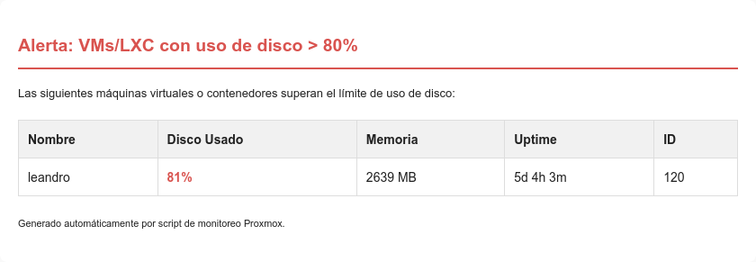

# Script para servidores virtualizados con Proxmox
## Verificar periódicamente el uso de disco
Debe correrse con cron, por ejemplo, cada 10 minutos:

`
*/10 * * * * /root/check_proxmox_disk_usage.sh
`

Ejemplo de un correo enviado:

